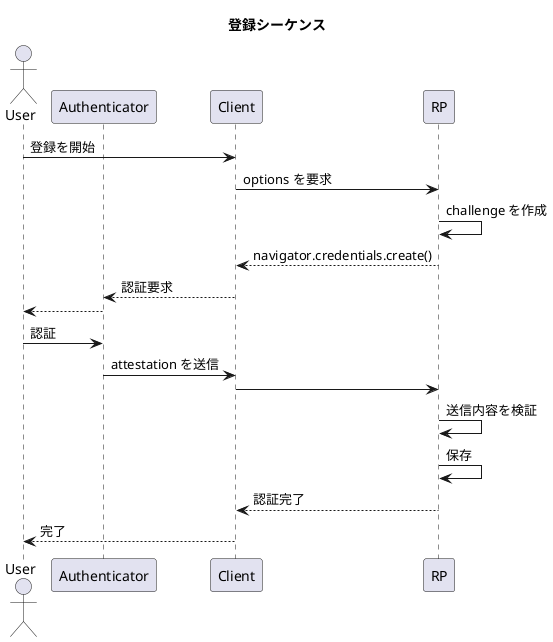

## シーケンス

以下に登録処理の概要を示します。



## サーバで実現すること

実装する API は 2 つあります。実装とともに以下に示します。

### 1. challenge の作成と保存

- 登録開始時に challenge を作成し、保存します。

```python
@bp.route("/generate-registration-options", methods=["GET"])
def register_options():
    # 登録済みのユーザー情報を取得
    # user = ...
    try:
        options = generate_registration_options(
            # ...
        )
        data = options_to_json_dict(options)
        session["challenge"] = options.challenge
        return jsonify(data)
    except Exception as e:
        # ...
```

### 2. 送信内容の検証

- クライアントから送信された内容を検証します。
  - challenge が保存したものと一致すること
  - origin が期待したものと一致すること
- `attestationObject` をパースし、公開鍵を取得・保存します。
  - 公開鍵を含む署名付きデータと理解してください。
- 認証処理が成功した際には challenge をクリアします。

```python
@bp.route("/verify-registration", methods=["POST"])
def register_verify():
    body = request.json
    # 登録済みのユーザー情報を取得
    # user = ...
    try:
        # 検証
        v = verify_registration_response(
            # ...
        )
        # ...
        # ユーザー情報に公開鍵を追加し、保存
        session["challenge"] = None
        return jsonify({"status": "ok", "verified": v.user_verified})
    except Exception as e:
        # ...
```
