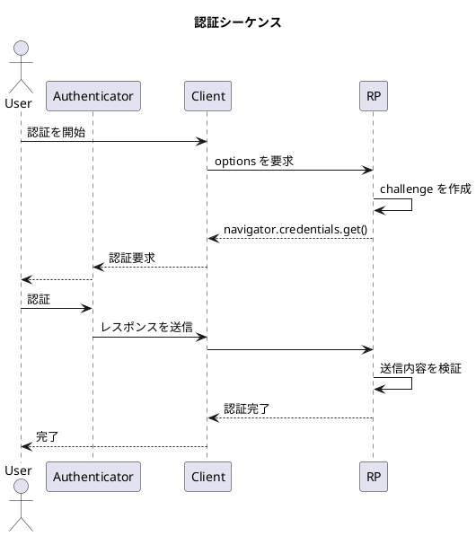

import { FileTree } from "@astrojs/starlight/components";

## シーケンス

以下に認証処理の概要を示します。登録時の処理とおおまかな流れは似ていることがわかります。



## サーバで実現すること

登録と同様に、 2 つの API が必要となります。 `backend/app/passkey_auth.py` の実装を交えながら、先ほどと同様にサーバで処理すべき内容を示していきます。

<FileTree>
- backend/
    - app/
        - db.py
        - login.py
        - model.py
        - **passkey_auth.py**
        - passkey_reg.py
        - users.py
    - .env
    - main.py
    - poc.py
    - pyproject.toml
    - ...

</FileTree>

### 1. challenge の作成と保存

- 認証開始時に challenge を作成し、保存します。

```python
@bp.route("/generate-authentication-options", methods=["GET"])
def authenticate_options():
    options = generate_authentication_options(
        # ...
    )

    data = options_to_json_dict(options)
    session["challenge"] = options.challenge
    return jsonify(data)
```

### 2. 送信内容の検証

- クライアントから送信された内容を検証します。
  - challenge が保存したものと一致すること
  - origin が期待したものと一致すること
- レスポンスの内容をパースし、公開鍵で検証します。
- 認証処理が成功した際には challenge をクリアします。

```python
@bp.route("/verify-authentication", methods=["POST"])
def authenticate_verify():
    body = request.json
    # 登録済みのユーザー情報を取得
    # user = ...
    # 公開鍵情報を取得
    # public_key = ...

    try:
        # 検証
        v = verify_authentication_response(
            # ...
            expected_challenge=session.get("challenge"),
            expected_origin=EXPECTED_ORIGIN,
            # ...
        )
        session["challenge"] = None
        session.clear()
        # 特定したユーザの認証を完了
        # login_user(user)
        return jsonify({"status": "ok", "verified": v.user_verified})
    except Exception as e:
        # ...
```
